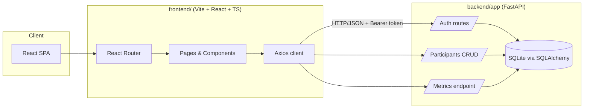

# Clinical Trial Dashboard

A full-stack demo application for managing clinical trial participants and visualizing study metrics.  
Built with **FastAPI**, **React + TypeScript**, **TailwindCSS**, JWT auth, and fully containerized with Docker.

---

## ✨ Features

### Backend (FastAPI)

- JWT authentication (`/auth/token`)
- CRUD for participants
- Aggregated analytics:
  - total participants
  - by status (`active`, `completed`, `withdrawn`, etc.)
  - by study group (`treatment`, `control`)
- SQLAlchemy ORM + SQLite
- Basic tests with Pytest

### Frontend (React + Vite + TS)

- Login with token-based auth (stores bearer token, redirects on success)
- Dashboard with live metrics from the backend
- Participants table with create / update / delete
- TailwindCSS UI with reusable utility classes (`card`, `btn`, `input`, etc.)
- Axios API client + Auth context
- Vitest + Testing Library tests:
  - `DashboardPage` renders with mocked metrics
  - `LoginPage` renders and wires up login form

---

## 🏗 Architecture Overview



---

## 🚀 Run Locally (without Docker)

### 1) Backend

```bash
cd backend
python -m venv .venv

# Windows:
.venv\Scripts\activate

# macOS / Linux:
# source .venv/bin/activate

pip install -r requirements.txt
uvicorn app.main:app --reload
```

Backend runs at:

- http://localhost:8000
- Swagger docs: http://localhost:8000/docs

### 2) Frontend

```bash
cd frontend
npm install
npm run dev
```

Frontend runs at (by default):

- http://localhost:5173

### Test credentials

```
username: admin
password: admin
```

---

## 🐳 Run with Docker

```bash
docker compose build
docker compose up
```

- Frontend → http://localhost:3000
- Backend → http://localhost:8000

---

## ✅ Tests

### Backend tests

```bash
cd backend
pytest
```

### Frontend tests

```bash
cd frontend
npm test
```

---

## 🧱 Tech Stack

### Backend

- FastAPI
- SQLAlchemy
- SQLite
- JWT auth (python-jose + passlib)
- Pydantic v2
- Uvicorn

### Frontend

- React 18
- TypeScript
- React Router
- TailwindCSS
- Axios
- Vitest + Testing Library

### DevOps

- Docker
- docker-compose
- GitHub Actions (CI)

---

## 📁 Project Structure

```
clinical-trial/
│── backend/
│   ├── app/
│   │   ├── main.py
│   │   ├── models.py
│   │   ├── auth.py
│   │   ├── schemas.py
│   │   ├── database.py
│   │   └── routes/
│   └── tests/
│── frontend/
│   ├── src/
│   ├── tests/
│   └── vite.config.ts
│── docker-compose.yml
│── README.md
```

---

## 🔄 CI (GitHub Actions)

This repo includes a sample CI workflow:

- Runs backend pytest
- Runs frontend vitest
- Validates Docker build

Located in: `.github/workflows/ci.yml`

---

## 🤝 Notes for Interviewers

This project demonstrates:

- Clean separation of concerns (backend vs frontend)
- Secure JWT-based auth flow
- SQLAlchemy ORM models & migrations
- React architecture & global state management
- Tailwind design system
- Comprehensive testing setup
- Dockerized full-stack system

> Some parts of this repo were implemented with the help of an AI pair‑programmer (ChatGPT).  
> All code and decisions were reviewed and finalized by me Temo Avalishvili.
